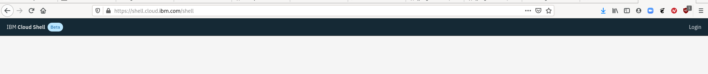
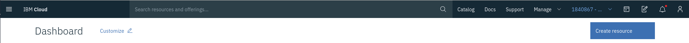

# Using the CLI in a Terminal

There are a couple ways to set up your environment and work on your computer or in the Web Shell. The goal is to connect a terminal window to a Red Hat OpenShift cluster.

## The Web Shell environment

If you prefer to use a predefined environment in a terminal available over a web browser, use either [​https://shell.cloud.ibm.com](https://shell.cloud.ibm.com)

or the [IBM Cloud Console](https://cloud.ibm.com).

You should see a terminal and an empty screen when you open your web shell.

Point your environment to IBM org. Select the first arrow to get to the IBM org, then select the second arrow to start the terminal.

<!--  (ed. - JJ, I think there was supposed to be a screenshot here. I'm not sure which arrows they're referring to up in the content.) -->

## Your local Terminal

If you want to use your own terminal, install Docker locally using Docker Desktop. <!-- (ed. - JJ, I'm not sure this makes sense. Are they supposed to be looking at the OpenShift CLI at this point? If so, I remember having to pull down the oc CLI through Homebrew. Do you need more directions here?) -->
