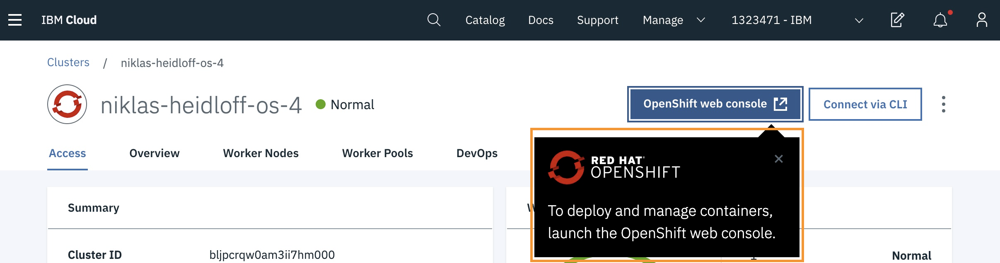
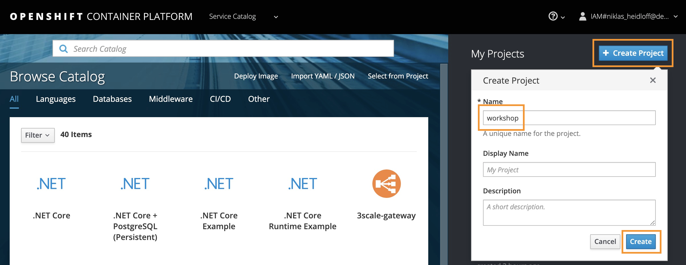
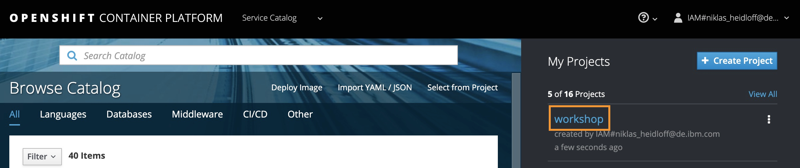
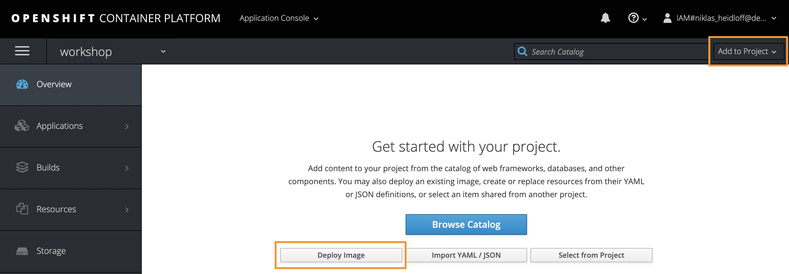
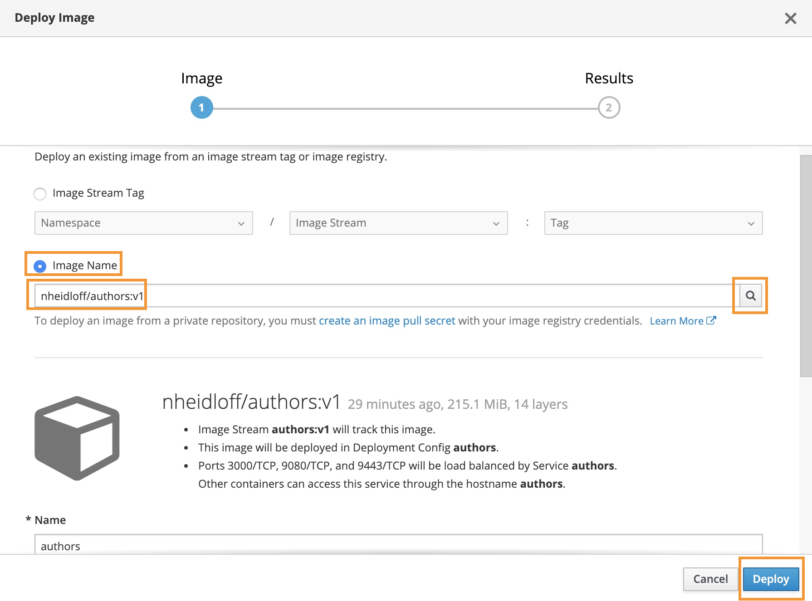
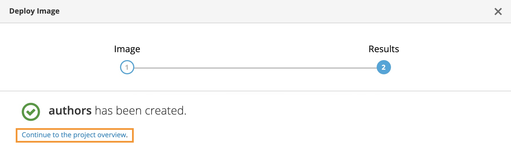
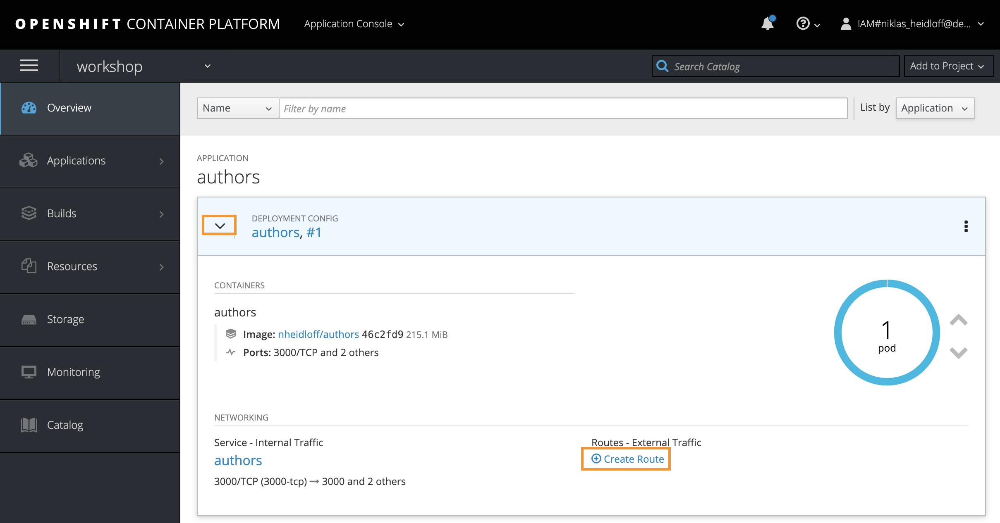
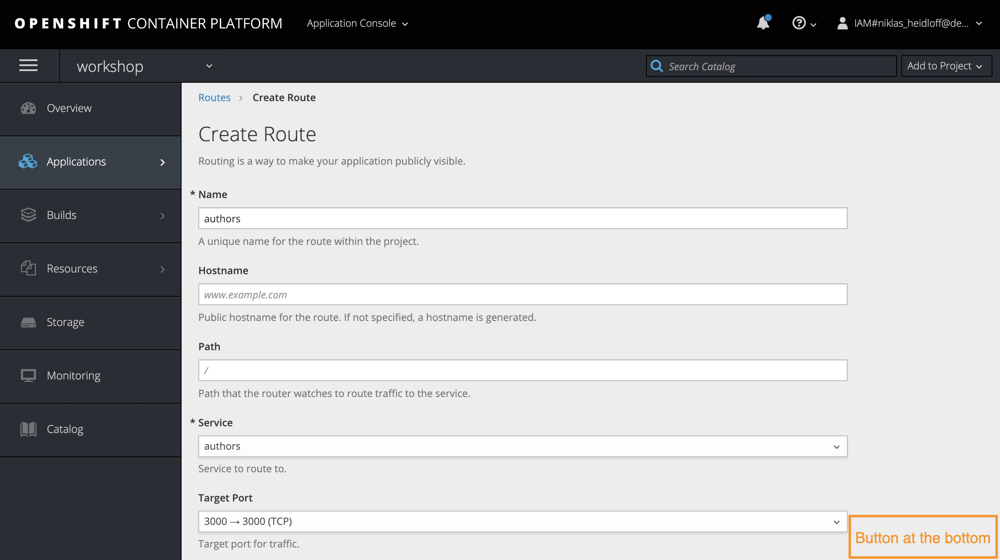
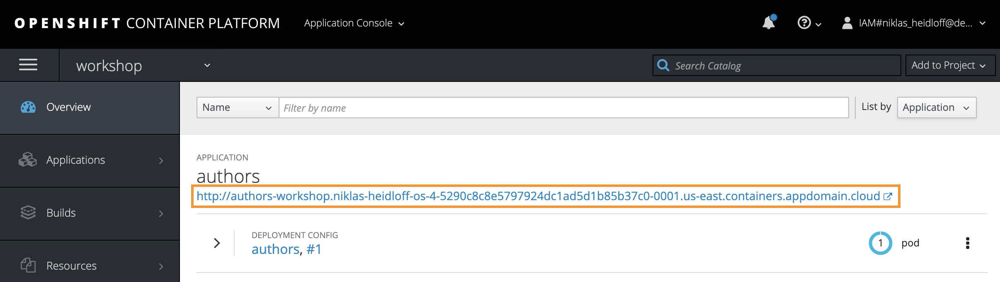
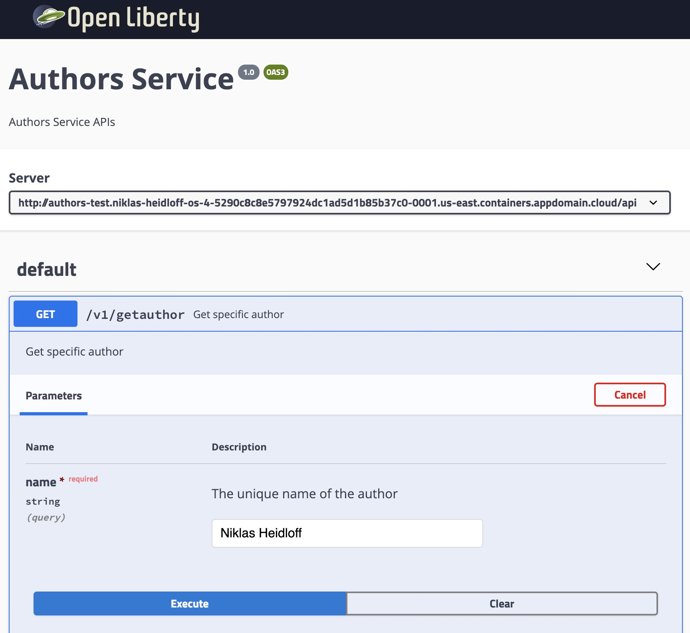

# Lab 2 - Using an existing image to create a project

In this lab, you will create and run a project from an existing container image.

## Overview

This is a quick lab that demonstrates how to deploy a public image from Docker Hub on OpenShift. As example image the 'authors' microservice from this workshop is used. <!-- ed. - From which workshop? I haven't encountered an `authors` microservice just yet. -->


Note: Not all images from Docker Hub can be installed. For example, OpenShift doesn't allow you to deploy images that run under 'root'. See the OpenShift documentation for details.


### Step 1

Open the OpenShift Console from the IBM Cloud OpenShift dashboard.



### Step 2

Create a new project called 'workshop'.



### Step 3

Open the new project.



### Step 4

Select 'Add to Project', followed by 'Deploy Image' in the pop-up menu, and then 'Deploy Image' in the dialog.



### Step 5

Enter 'nheidloff/authors:v1' as the image name, then select the search icon and then the 'Deploy' button.



### Step 6

Navigate back to the overview page.



### Step 7

Select 'Create Route'.



### Step 8

Select the 'Create' button (not shown in the screenshot; scroll down to find it).



### Step 9

Copy the URL near the top of the page, and append '/openapi/ui'.




Add `/openapi/ui` to the end of the URL


### Step 10

Open the Open API user interface by pasting in the adjusted URL to try the REST API.



### Stretch Goal: Use your own Image

You can deploy your image from the next Lab 3. <!-- ed. - So should they come back here after completing the next lab? -->

If you want, you can make changes to the Java code and/or image, and push these changes to your own Docker Hub account. To do this, you need a Docker Hub account. Then, invoke these commands:

```bash
$ cd ${ROOT_FOLDER}/2-deploying-to-openshift
$ DOCKER_ACCOUNT=<your-docker-account>
$ docker login
$ docker build -t $DOCKER_ACCOUNT/authors:v1 .
$ docker push $DOCKER_ACCOUNT/authors:v1
```

## Success!

Congratulations! You finished Lab 2 and deployed an image from a public registry available from Docker Hub.
