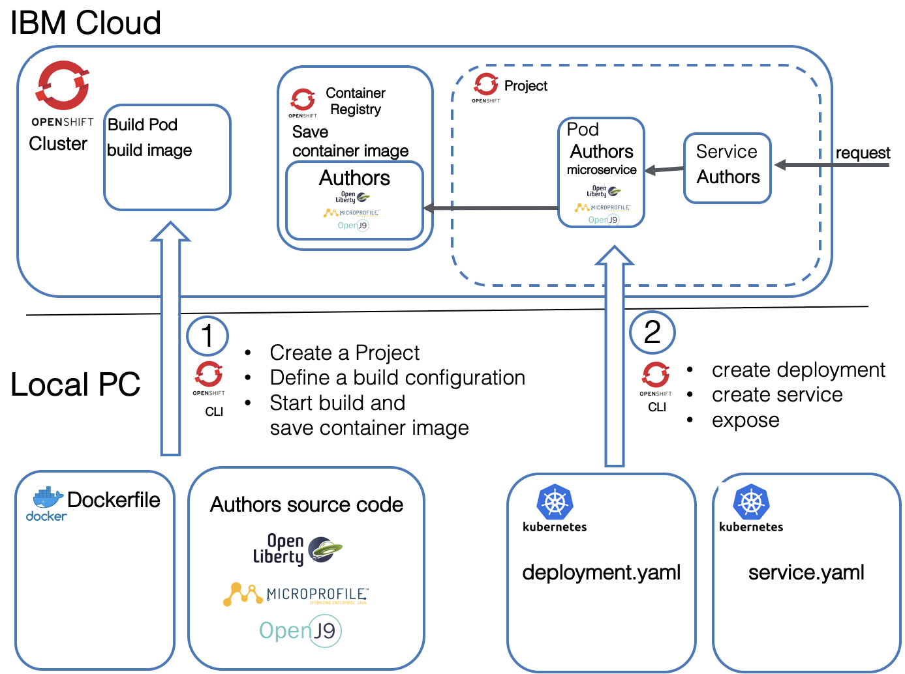
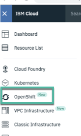
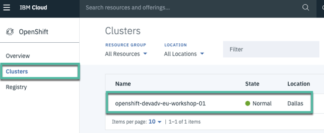
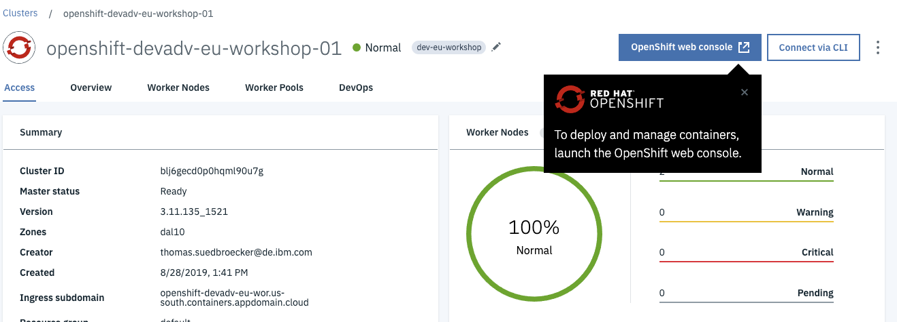
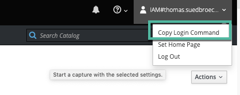

# Lab 3 - Deploying a Project to Red Hat OpenShift Kubernetes Cluster

Lab 3 consists of two parts:

- Setting up the environment for Lab 3
- Creating a Red Hat OpenShift project

The basic architecture of the project, as shown, uses some work on your local machine deployed to your IBM Cloud instance, all managed using the OpenShift CLI.



## Setting up

During this lab, you will use your recently created project and deploy it to your cluster.

### Tools

Use the option for tools the most suitable for you.

#### Option 1: Prebuilt Image with Local Code

There is an image on Docker Hub with all required tools. To use local IDEs and editors to modify code and configuration files, a Docker volume is used.


This option works only for Mac and Linux.


##### Step 1

Run these commands in a terminal

```bash
$ git clone https://github.com/IBM/openshift-on-ibm-cloud-workshops.git
$ cd openshift-on-ibm-cloud-workshops
$ ROOT_FOLDER=$(pwd)
$ docker run -v $ROOT_FOLDER/:/cloud-native-starter -it --rm nheidloff/openshift-workshop-tools:v1
```

##### Step 2

Inside your running Docker image, you can access your the local project. You should see the prompt like `root@3f46c41f7303:/usr/local/bin#`. Now run the following instructions:

```bash
$ cd /cloud-native-starter/
$ ls
$ ROOT_FOLDER=$(pwd)
```


With the `--rm` option in the docker run command the container is deleted once you exit. This is intended.


##### Step 3

Move on with Verify Access to OpenShift on the IBM Cloud

#### Option 2: Prebuilt Image with Code in Container


Preferred option for Windows.

This option works for Mac, Linux, or Windows.


There is an image on DockerHub with all required tools. To get started as quickly as possible, use this image.

##### Step 1

Run this command in a terminal

```bash
$ docker run -ti nheidloff/openshift-workshop-tools:v1
```

##### Step 2

After the container has been started, run these commands inside your running Docker image to get the latest version of the workshop: You should see the prompt like this:

```bash
root@3f46c41f7303:/usr/local/bin#
```
Now run the following instructions:

```bash
$ cd
$ git clone https://github.com/IBM/openshift-on-ibm-cloud-workshops.git$ cd openshift-on-ibm-cloud-workshops
$ ROOT_FOLDER=$(pwd)
```

If you using Windows, you also need to download or clone the project to your local workstation for the upcoming Docker and Java lab, because you can't use Docker in the 'openshift-workshop-tools' Docker image.


##### Step 3

Move on with Verify Access to OpenShift on the IBM Cloud

#### Option 3: Install Tools locally on your desktop computer


This approach works only for Mac and Linux.


##### Step 1

Install the following tools:
* `oc`
* `kubectl`
* `git`
* `curl`.
* (_optional_) IBM Cloud CLI
* (_optional_) Editor, for example Visual Studio Code

##### Step 2

Get the code:

```bash
$ git clone https://github.com/IBM/openshift-on-ibm-cloud-workshops.git
$ cd openshift-on-ibm-cloud-workshops
$ ROOT_FOLDER=$(pwd)
```

##### Step 3

Move on with Verify Access to OpenShift on the IBM Cloud

## Verify Access to OpenShift on the IBM Cloud

###  Step 1

After you've created a new cluster, open the OpenShift console.

- Log onto the IBM Cloud web console, and choose the IBM organization.

- Select OpenShift in the menu.


- Chose Clusters and select your OpenShift cluster.


- Open the OpenShift web console.


###  Step 2

Get your access token for the 'oc' CLI.

- From the dropdown menu in the upper right of the page, select **Copy Login Command**. Paste the copied command into your terminal.


- Verify the 'oc' CLI
```bash
$ oc login https://c1-e.us-east.containers.cloud.ibm.com:23967 --token=xxxxxx'
$ oc get istag
```
- Verify 'kubectl' CLI
```bash
$ kubectl get pods
```

Congratulations! You are ready to start Lab 3. <!-- ed. - Do you mean you've completed Lab 3? Or have they not started yet? -->
